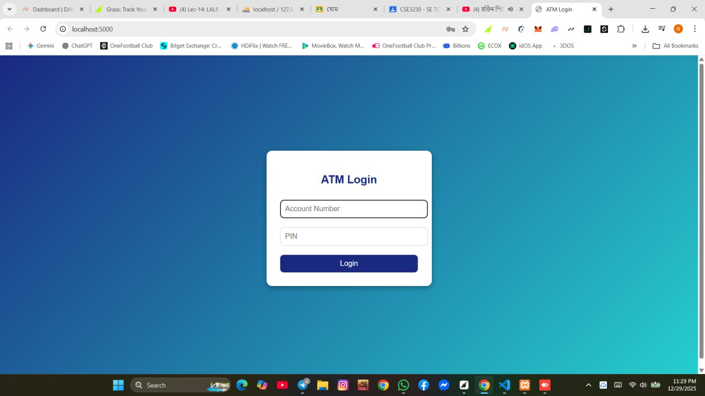
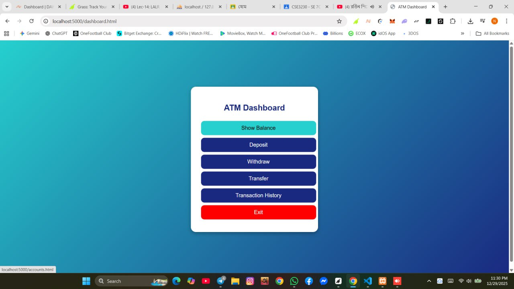
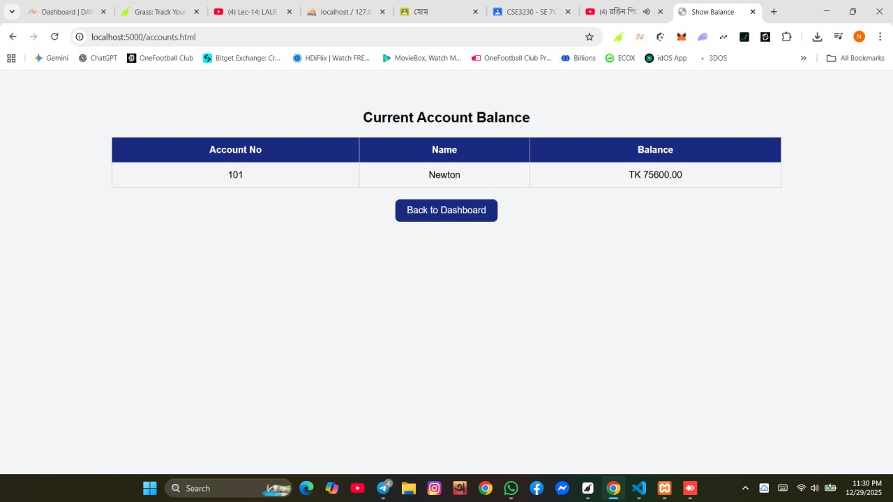
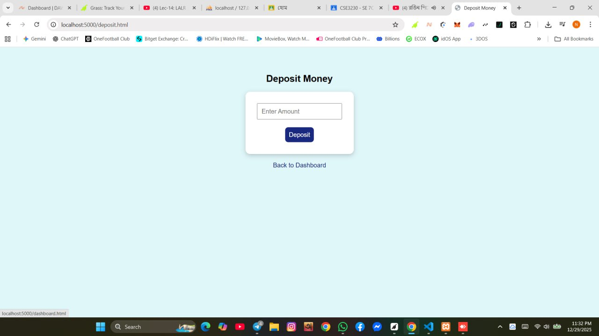
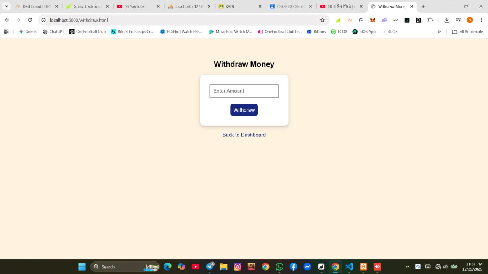
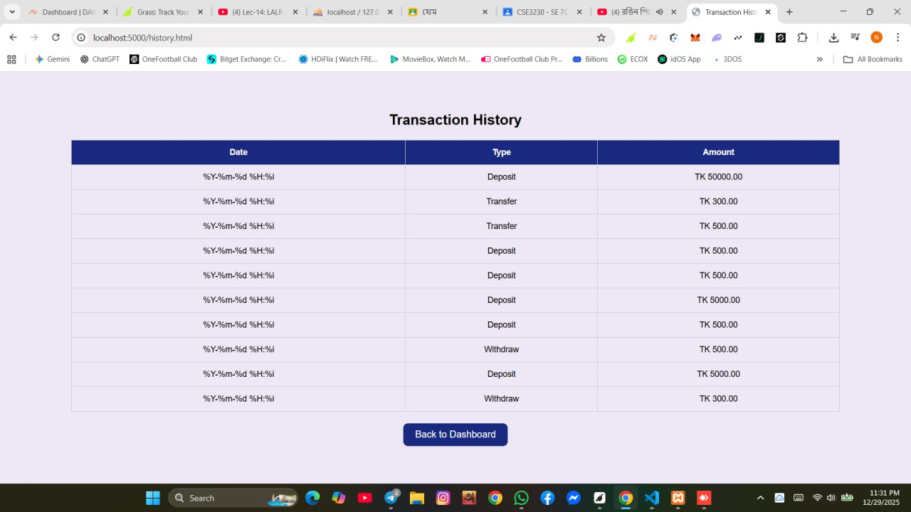

# Bank Management System

## Description-
This is a Bank Management System web application that allows bank administrators and customers to manage basic ATM operations online.Customers can create an account, log in, deposit money, withdraw money, and transfer funds.

---

### It includes :
- Homepage
- Customer Registration
- Login System
- Deposit Money
- Withdraw Money
- Fund Transfer
- Transaction History

---

## Technologies Used-

### Front end Technologies:
- HTML
- CSS
- Bootstrap
- JavaScript

### Back end Technologies:
- Phython

### Database:
- MySQL

### Webserver:
- XAMPP

---

## Snapshots

### 1.Login Page

### 2.Dashboard

### 3.Balance Page

### 4.Deposit Page

### 5.Withdraw Page

### 6.Transaction History

## Thank You
