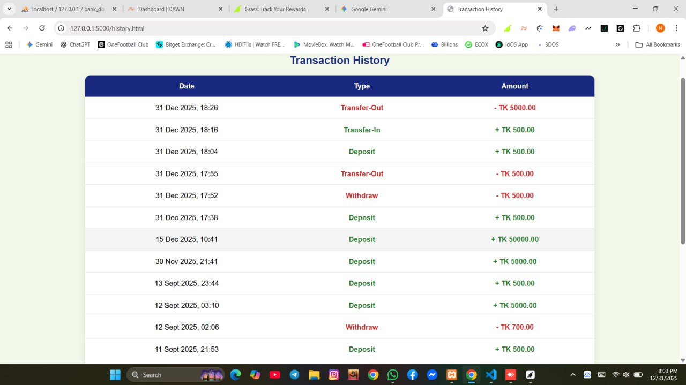

# 🏦 Bank Management System

##  Description
This is a Bank Management System web application that allows customers to perform basic banking and ATM operations online.  
Users can create an account, log in, deposit money, withdraw money, transfer funds, and view transaction history securely.

---

##  Features
- User Registration and Login
- Dashboard
- Balance Inquiry
- Deposit Money
- Withdraw Money
- Fund Transfer
- Transaction History

---

##  Technologies Used

### Frontend
- HTML
- CSS
- Bootstrap
- JavaScript

### Backend
- Python (Flask)

### Database
- MySQL

### Web Server
- XAMPP

---

##  Snapshots

###  Login Page

###  Dashboard

###  Balance Information

###  Deposit Money

###  Withdraw Money

###  Fund Transfer

###  Transaction History

---

##  Documentation
- 📘 **Project Report (PDF):**  
  [Click here to view the Project Report](report/Bank_Management.pdf)

---

##  Thank You

